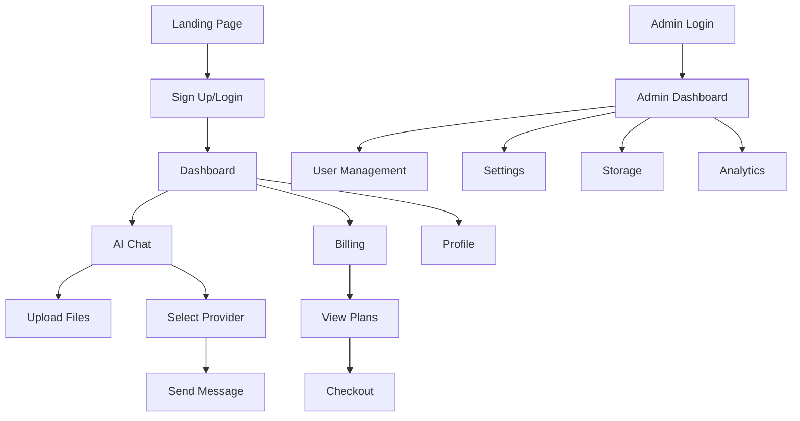

# Documento de Requisitos do Produto - Template SaaS Next.js

## 1. Visão Geral do Produto

O **Template SaaS Next.js** é uma solução completa e pronta para produção que acelera o desenvolvimento de aplicações SaaS. Combina autenticação robusta, sistema de créditos flexível, integração com IA e interface moderna para criar uma base sólida para microsaas e aplicações empresariais.

- **Propósito Principal**: Fornecer uma base técnica completa para desenvolvedores criarem produtos SaaS rapidamente, eliminando a necessidade de implementar funcionalidades básicas do zero.
- **Público-alvo**: Desenvolvedores, startups e empresas que desejam lançar produtos SaaS com rapidez e qualidade profissional.
- **Valor de Mercado**: Reduz o tempo de desenvolvimento de 3-6 meses para 2-4 semanas, permitindo foco total nas funcionalidades específicas do negócio.

## 2. Funcionalidades Principais

### 2.1 Perfis de Usuário

| Perfil | Método de Registro | Permissões Principais |
|--------|-------------------|----------------------|
| Usuário Padrão | Email via Clerk | Acesso ao dashboard, chat IA, consumo de créditos |
| Administrador | Convite/configuração manual | Gestão completa de usuários, créditos, planos e configurações |

### 2.2 Módulos Funcionais

Nossa solução consiste nas seguintes páginas principais:

1. **Landing Page**: seção hero, navegação, grid de recursos, preços e FAQ
2. **Dashboard Protegido**: visão geral de créditos, uso e estatísticas pessoais
3. **Chat IA**: interface de conversação com múltiplos provedores de IA e upload de arquivos
4. **Billing/Assinaturas**: gestão de planos, upgrade/downgrade e histórico de pagamentos
5. **Painel Administrativo**: gestão de usuários, créditos, configurações e analytics
6. **Autenticação**: páginas de login e registro integradas com Clerk

### 2.3 Detalhes das Páginas

| Nome da Página | Módulo | Descrição da Funcionalidade |
|----------------|--------|------------------------------|
| Landing Page | Hero Section | Apresenta proposta de valor com animações e call-to-action principal |
| Landing Page | Bento Grid | Exibe recursos principais em layout moderno e responsivo |
| Landing Page | Pricing | Lista planos disponíveis com toggle mensal/anual e botões de checkout |
| Landing Page | FAQ | Responde dúvidas frequentes sobre o produto e implementação |
| Dashboard | Credit Status | Mostra saldo atual, histórico de uso e botão para comprar créditos |
| Dashboard | Usage Analytics | Gráficos de consumo por período e tipo de operação |
| Chat IA | Provider Selection | Dropdown para escolher provedor (OpenAI, Anthropic, Google, Mistral, OpenRouter) |
| Chat IA | Message Interface | Interface de chat com streaming, markdown e anexos clicáveis |
| Chat IA | File Upload | Upload de arquivos para Vercel Blob com preview e integração no prompt |
| Billing | Plan Grid | Exibe planos disponíveis com recursos, preços e botões de ação |
| Billing | Subscription Status | Status atual da assinatura, próxima cobrança e opções de cancelamento |
| Admin | User Management | Lista usuários, ajusta créditos, visualiza uso e gerencia permissões |
| Admin | Settings Panel | Configura custos por feature, créditos por plano e integrações |
| Admin | Storage Management | Visualiza uploads, uso de storage e opções de limpeza |
| Autenticação | Login/Register | Formulários integrados com Clerk para autenticação segura |

## 3. Fluxos Principais

### Fluxo do Usuário Padrão
O usuário acessa a landing page, visualiza recursos e preços, cria conta via Clerk, recebe créditos iniciais, explora o dashboard, utiliza o chat IA consumindo créditos, monitora saldo e realiza upgrade quando necessário.

### Fluxo do Administrador
O admin acessa painel específico, visualiza métricas gerais, gerencia usuários e créditos, configura custos e planos, monitora uso de storage e ajusta configurações do sistema.

## 4. Design da Interface

### 4.1 Estilo de Design

- **Cores Primárias**: Sistema de cores baseado em CSS variables com suporte a tema claro/escuro
- **Estilo de Botões**: Componentes Radix UI com variantes (default, destructive, outline, secondary, ghost)
- **Tipografia**: Inter como fonte principal com tamanhos responsivos (text-sm a text-4xl)
- **Layout**: Design card-based com navegação superior e sidebar responsiva
- **Ícones**: Lucide React para consistência visual e performance

### 4.2 Visão Geral do Design das Páginas

| Nome da Página | Módulo | Elementos UI |
|----------------|--------|--------------|
| Landing Page | Hero Section | Gradiente de fundo, tipografia grande, botões com hover effects e animações Framer Motion |
| Landing Page | Bento Grid | Cards com glassmorphism, ícones coloridos e micro-interações |
| Dashboard | Credit Status | Badge com ícone de moeda, tooltip informativo e botão de recarga |
| Chat IA | Message Interface | Bubbles diferenciadas por role, syntax highlighting para código e loading states |
| Admin | Data Tables | Tabelas responsivas com sorting, filtering e paginação |
| Billing | Plan Cards | Cards destacados com badges, listas de features e CTAs prominentes |

### 4.3 Responsividade

O produto é **mobile-first** com breakpoints Tailwind (sm, md, lg, xl, 2xl). Inclui otimizações para touch, navegação adaptativa e componentes que se reorganizam automaticamente em telas menores.

## 5. Integrações e APIs

### 5.1 Autenticação (Clerk)
- Login social (Google, GitHub) e email/senha
- Middleware de proteção de rotas
- Webhooks para sincronização de dados
- Gestão de sessões e tokens

### 5.2 Provedores de IA
- **OpenAI**: GPT-4, GPT-3.5 com streaming
- **Anthropic**: Claude 3.5 Sonnet
- **Google**: Gemini 2.0 Flash
- **Mistral**: Mistral Small Latest
- **OpenRouter**: Acesso a múltiplos modelos via API unificada

### 5.3 Pagamentos e Billing
- Integração com Stripe via Clerk Commerce
- Webhooks para eventos de assinatura
- Suporte a planos mensais e anuais
- Packs de créditos avulsos

### 5.4 Storage e Uploads
- Vercel Blob para armazenamento de arquivos
- Upload seguro com validação de tipo e tamanho
- URLs temporárias e gestão de lifecycle

## 6. Sistema de Créditos

### 6.1 Modelo de Consumo
- **Chat IA**: 1 crédito por mensagem
- **Geração de Imagem**: 5 créditos por imagem
- Custos configuráveis via painel admin
- Reembolso automático em caso de falha

### 6.2 Distribuição de Créditos
- Plano Free: 100 créditos iniciais
- Planos pagos: créditos mensais conforme tier
- Packs avulsos: compra adicional via Stripe
- Sistema de rollover configurável

## 7. Segurança e Compliance

### 7.1 Autenticação e Autorização
- Tokens JWT via Clerk
- Middleware de proteção em todas as rotas sensíveis
- Validação de permissões no backend
- Rate limiting por usuário

### 7.2 Proteção de Dados
- Variáveis de ambiente para secrets
- Validação de input com Zod
- Sanitização de uploads
- Logs de auditoria para ações administrativas

### 7.3 APIs Seguras
- CORS configurado adequadamente
- Validação de origem das requisições
- Timeouts e circuit breakers
- Monitoramento de uso anômalo

## 8. Analytics e Monitoramento

### 8.1 Métricas de Negócio
- Conversão de visitantes para usuários
- Taxa de upgrade para planos pagos
- Consumo médio de créditos por usuário
- Churn rate e lifetime value

### 8.2 Métricas Técnicas
- Performance das APIs de IA
- Tempo de resposta do chat
- Taxa de erro por provedor
- Uso de storage e bandwidth

### 8.3 Ferramentas Integradas
- Google Analytics 4
- Google Tag Manager
- Facebook Pixel
- Health checks automáticos